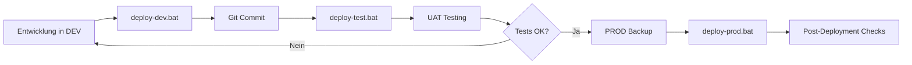

# Power Platform Solution Deployment

Automatisierte Deployment-Scripts für Power Platform Solutions mit PAC CLI.

## 🎯 Übersicht

Dieses Repository enthält Scripts für den kompletten ALM-Lifecycle:
**DEV** → **Git** → **TEST** → **PROD**

## 📁 Deployment-Dateien

| Datei | Beschreibung |
|-------|-------------|
| **`deploy-solution.ps1`** | Haupt-Script mit allen Deployment-Optionen |
| **`deploy-dev.bat`** | Quick-Command für DEV → Git |
| **`deploy-test.bat`** | Quick-Command für Git → TEST |
| **`deploy-prod.bat`** | Quick-Command für Git → PROD (mit Sicherheits-Checks) |
| **`.env.example`** | Template für Environment-Konfiguration |

## 📚 Dokumentation

| Dokument | Zielgruppe | Inhalt |
|----------|------------|--------|
| **[QUICK-START.md](QUICK-START.md)** | Alle | Eine Seite mit den wichtigsten Commands (zum Ausdrucken) |
| **[DEPLOYMENT-INSTRUCTIONS.md](DEPLOYMENT-INSTRUCTIONS.md)** | Entwickler | Vollständige Schritt-für-Schritt Anleitung mit Szenarien |
| **[DEPLOYMENT-WORKFLOW.md](DEPLOYMENT-WORKFLOW.md)** | Tech Leads | Visuelle Workflows, Decision Trees, Best Practices |
| **[DEPLOYMENT-CHEATSHEET.md](DEPLOYMENT-CHEATSHEET.md)** | Alle | Schnellreferenz für häufige Commands |
| **[docs/DEPLOYMENT-GUIDE.md](docs/DEPLOYMENT-GUIDE.md)** | DevOps | Technisches Handbuch, CI/CD Integration |

## 🚀 Schnellstart

### 1. Installation (einmalig)

```powershell
# PAC CLI installieren
dotnet tool install --global Microsoft.PowerApps.CLI.Tool

# Environments verbinden
pac auth create --environment https://ihre-org-dev.crm4.dynamics.com
pac auth create --environment https://ihre-org-test.crm4.dynamics.com
pac auth create --environment https://ihre-org-prod.crm4.dynamics.com
```

### 2. Configuration

```powershell
# .env Datei erstellen
copy .env.example .env

# .env mit deinen Werten füllen
notepad .env
```

### 3. Deployment Commands

```powershell
# DEV → Git (nach Entwicklung)
.\deploy-dev.bat YourSolutionName

# Git → TEST (für UAT)
.\deploy-test.bat YourSolutionName

# Git → PROD (nach Approval)
.\deploy-prod.bat YourSolutionName
```

## 🔄 Typischer Workflow



## 📊 Environment Strategy

| Environment | Solution Type | Direktes Editieren | Deployment-Frequenz |
|-------------|---------------|-------------------|---------------------|
| **DEV** | Unmanaged | ✅ Ja | Täglich |
| **TEST** | Managed | ❌ Nein | Wöchentlich |
| **PROD** | Managed | ❌ Niemals | Monatlich/On-Demand |

## 🛠️ Script-Optionen

### deploy-solution.ps1 (Advanced)

```powershell
# Vollständige Syntax
.\deploy-solution.ps1 `
    -SolutionName "YourSolution" `
    -TargetEnv "TEST" `
    [-Export] `
    [-Managed] `
    [-SkipChecks] `
    [-ExportPath "./exports"] `
    [-SourcePath "./src"]
```

**Parameter:**
- `-SolutionName`: Technischer Name der Solution (erforderlich)
- `-TargetEnv`: `DEV`, `TEST`, oder `PROD` (erforderlich)
- `-Export`: Aus Environment exportieren (statt aus ./src/ zu packen)
- `-Managed`: Als managed Solution deployen
- `-SkipChecks`: Bestätigungen überspringen (für CI/CD)
- `-ExportPath`: Pfad für Exports (default: `./exports`)
- `-SourcePath`: Pfad für Source Control (default: `./src`)

### Beispiele

```powershell
# Beispiel 1: Standard DEV export
.\deploy-solution.ps1 -SolutionName "CRM_Core" -TargetEnv DEV -Export

# Beispiel 2: TEST deployment (managed)
.\deploy-solution.ps1 -SolutionName "CRM_Core" -TargetEnv TEST -Managed

# Beispiel 3: PROD deployment mit Custom Path
.\deploy-solution.ps1 -SolutionName "CRM_Core" -TargetEnv PROD -Managed -ExportPath "C:\Backups"

# Beispiel 4: CI/CD ohne Prompts
.\deploy-solution.ps1 -SolutionName "CRM_Core" -TargetEnv TEST -Managed -SkipChecks

# Beispiel 5: Direkt von DEV zu TEST
.\deploy-solution.ps1 -SolutionName "CRM_Core" -TargetEnv TEST -Export -Managed
```

## 🔒 Sicherheits-Features

### Automatische Validierung

- ✅ **PROD erzwingt managed Solutions** - Script verweigert unmanaged in PROD
- ✅ **Doppelte Bestätigung für PROD** - Versehentliche Deployments verhindert
- ✅ **Solution Checker Integration** - Automatische Code-Qualitäts-Prüfung
- ✅ **Environment Rule Validation** - Warnung bei unüblichen Setups

### Best Practice Enforcement

```powershell
# ❌ Dieses Command wird blockiert:
.\deploy-solution.ps1 -SolutionName "MySolution" -TargetEnv PROD
# Error: PROD environment requires managed solutions. Use -Managed flag.

# ✅ Korrekt:
.\deploy-solution.ps1 -SolutionName "MySolution" -TargetEnv PROD -Managed
```

## 📦 Verzeichnis-Struktur

```
PowerApps-Vibe-Claude/
├── deploy-solution.ps1          # Haupt-Script
├── deploy-dev.bat               # DEV Quick-Command
├── deploy-test.bat              # TEST Quick-Command
├── deploy-prod.bat              # PROD Quick-Command
├── .env.example                 # Environment Template
├── .env                         # Deine Konfiguration (nicht in Git!)
├── .gitignore                   # Ignoriert exports/, backups/
│
├── src/                         # Solution Source Control
│   ├── Other/
│   │   └── Solution.xml         # Solution Metadata
│   ├── CanvasApps/
│   ├── Workflows/
│   └── ...
│
├── exports/                     # Exported ZIP files (nicht in Git)
│   ├── MySolution-unmanaged-20250115.zip
│   └── checker-results/         # Solution Checker Output
│
├── backups/                     # PROD Backups (nicht in Git)
│   └── MySolution-backup-20250115.zip
│
└── docs/
    ├── QUICK-START.md
    ├── DEPLOYMENT-INSTRUCTIONS.md
    ├── DEPLOYMENT-WORKFLOW.md
    ├── DEPLOYMENT-CHEATSHEET.md
    └── DEPLOYMENT-GUIDE.md
```

## 🔍 Troubleshooting

### Häufige Probleme

| Problem | Lösung |
|---------|--------|
| "pac: command not found" | PowerShell neu starten, `pac --version` prüfen |
| "Solution not found" | `pac solution list` - nutze technischen Namen |
| "Authentication failed" | `pac auth create --environment <URL>` |
| "Missing dependencies" | Dependencies zuerst deployen |
| "Import conflicts" | `--force-overwrite` flag nutzen |

### Logs

```powershell
# PAC CLI Logs
Get-Content "$env:USERPROFILE\.pac\logs\latest.log"

# Script Output
# Wird automatisch in Console angezeigt (farbcodiert)
```

## 🎓 Lernpfad

**Neu im Team?** Folge dieser Reihenfolge:

1. ✅ **Lies:** [QUICK-START.md](QUICK-START.md) (5 Min)
2. ✅ **Installiere:** PAC CLI und authentifiziere (10 Min)
3. ✅ **Teste:** `.\deploy-dev.bat` mit Test-Solution (15 Min)
4. ✅ **Lies:** [DEPLOYMENT-INSTRUCTIONS.md](DEPLOYMENT-INSTRUCTIONS.md) (30 Min)
5. ✅ **Übe:** 3-5 DEV Deployments mit echten Änderungen (1 Woche)
6. ✅ **Fortgeschritten:** [DEPLOYMENT-WORKFLOW.md](DEPLOYMENT-WORKFLOW.md) (20 Min)
7. ✅ **Deploy TEST:** Mit Mentor zusammen (1 Stunde)
8. ✅ **Lies:** [DEPLOYMENT-GUIDE.md](docs/DEPLOYMENT-GUIDE.md) für CI/CD (45 Min)

## 🚨 Emergency Procedures

### Rollback nach fehlgeschlagenem PROD Deployment

```powershell
# 1. Zu PROD verbinden
pac auth select --index 3

# 2. Backup importieren
pac solution import --path "./backups/backup-YYYYMMDD-HHMM.zip" --force-overwrite

# 3. Funktionstest durchführen

# 4. Stakeholder informieren

# 5. Root-Cause-Analyse dokumentieren
```

### Hotfix für kritischen PROD Bug

```powershell
# 1. Hotfix-Branch
git checkout -b hotfix/critical-issue

# 2. In DEV fixen + testen

# 3. Export
.\deploy-dev.bat YourSolution

# 4. Commit
git add src/
git commit -m "fix: Critical issue in approval logic"
git push

# 5. Quick TEST (optional bei Critical)
.\deploy-test.bat YourSolution

# 6. BACKUP + DEPLOY PROD
pac auth select --index 3
pac solution export --name "YourSolution" --path "./backups/hotfix-backup-$(Get-Date -Format 'yyyyMMdd-HHmm').zip" --managed
.\deploy-prod.bat YourSolution

# 7. Merge Hotfix
git checkout main
git merge hotfix/critical-issue
git push
```

## 🤝 Beitragen

### Script-Verbesserungen

1. Fork Repository
2. Feature-Branch erstellen: `git checkout -b feature/improve-error-handling`
3. Änderungen implementieren und testen
4. Pull Request erstellen

### Dokumentations-Updates

Dokumentation out-of-date? Bitte PR erstellen oder Issue öffnen!

## 📞 Support

### Hilfe bekommen

1. **Dokumentation durchsuchen:**
   - Quick Fix: [QUICK-START.md](QUICK-START.md)
   - Detailed Steps: [DEPLOYMENT-INSTRUCTIONS.md](DEPLOYMENT-INSTRUCTIONS.md)
   - Troubleshooting: [DEPLOYMENT-GUIDE.md](docs/DEPLOYMENT-GUIDE.md)

2. **Logs prüfen:**
   ```powershell
   Get-Content "$env:USERPROFILE\.pac\logs\latest.log"
   ```

3. **Team fragen:**
   - Tech Lead für PROD Approvals
   - DevOps für CI/CD Issues
   - Team-Chat für allgemeine Fragen

4. **External Resources:**
   - [PAC CLI Docs](https://learn.microsoft.com/power-platform/developer/cli/introduction)
   - [ALM Guide](https://learn.microsoft.com/power-platform/alm/)
   - [Community Forum](https://powerusers.microsoft.com/)

## 📜 Lizenz

Siehe [LICENSE](LICENSE) Datei für Details.

## 🔗 Verwandte Ressourcen

- **Main Projekt Docs:** [CLAUDE.md](CLAUDE.md)
- **Power Fx Templates:** [src/App-Formulas-Template.fx](src/App-Formulas-Template.fx)
- **Migration Guide:** [docs/MIGRATION-GUIDE.md](docs/MIGRATION-GUIDE.md)
- **PAC CLI Reference:** https://learn.microsoft.com/power-platform/developer/cli/reference/solution

---

**Version:** 1.0.0
**Last Updated:** 2025-01-15
**Maintained by:** PowerApps Development Team
